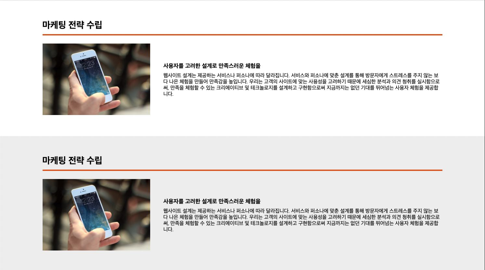

# 회고



```
// 각 영역을 article로 만듦
<article>
      <div class="l-center l-center--article"> // l-center의 modifier 를 추가 했다. (padding-t90, bottom)
        <h2 class="heading-lv2">마케팅 전략 수립</h2> // 현재 페이지에서는 공통으로 쓰이지만 하단 media는
                                                  // 이 타이틀을 제외하고 재사용 될 것 같아 media와 같은
                                                  // 컴포넌트로 넣지 않음
        <div class="media"> // flex값을 잡기 참 힘들다.
          <picture class="media__img">
             // cls를 위해 비율만 맞춰서 width, height를
                                                    // 넣으려 했으나 그랬다가는 반응형 작업이 귀찮아 지게 된다.
          </picture>
          <dl class="media__content">
            <dt class="media__tit">사용자를 고려한 설계로 만족스러운 체험을</dt>
            <dd class="media__text">웹사이트 설계는 제공하는 서비스나 퍼소나에 따라 달라집니다. 서비스와 퍼소나에 맞춘 설계를 통해 방문자에게 스트레스를 주지 않는 보다 나은
              체험을 만들어
              만족감을 높입니다.
              우리는 고객의 사이트에 맞는 사용성을 고려하기 때문에 세심한 분석과 의견 청취를 실시함으로써, 만족을 체험할 수 있는 크리에이티브 및 테크놀로지를 설계하고 구현함으로써 지금까지는
              없던 기대를
              뛰어넘는 사용자 체험을 제공합니다.</dd>
          </dl>
        </div>
      </div>
    </article>

    <article class="article-has-bg"> // 화면 좌우 까지 배경색이 들어가야 해서 class 추가
      <div class="l-center l-center--article">
        <h2 class="heading-lv2">마케팅 전략 수립</h2>
        <div class="media media--reverse"> // 이미지와 텍스트의 위치가 반대려서 block--modifier
          <picture class="media__img">
            
          </picture>
          <dl class="media__content">
            <dt class="media__tit">사용자를 고려한 설계로 만족스러운 체험을</dt>
            <dd class="media__text">웹사이트 설계는 제공하는 서비스나 퍼소나에 따라 달라집니다. 서비스와 퍼소나에 맞춘 설계를 통해 방문자에게 스트레스를 주지 않는 보다 나은 체험을
              만들어
              만족감을 높입니다.
              우리는 고객의 사이트에 맞는 사용성을 고려하기 때문에 세심한 분석과 의견 청취를 실시함으로써, 만족을 체험할 수 있는 크리에이티브 및 테크놀로지를 설계하고 구현함으로써 지금까지는 없던 기대를
              뛰어넘는 사용자 체험을 제공합니다.</dd>
          </dl>
        </div>
      </div>
    </article>
```
